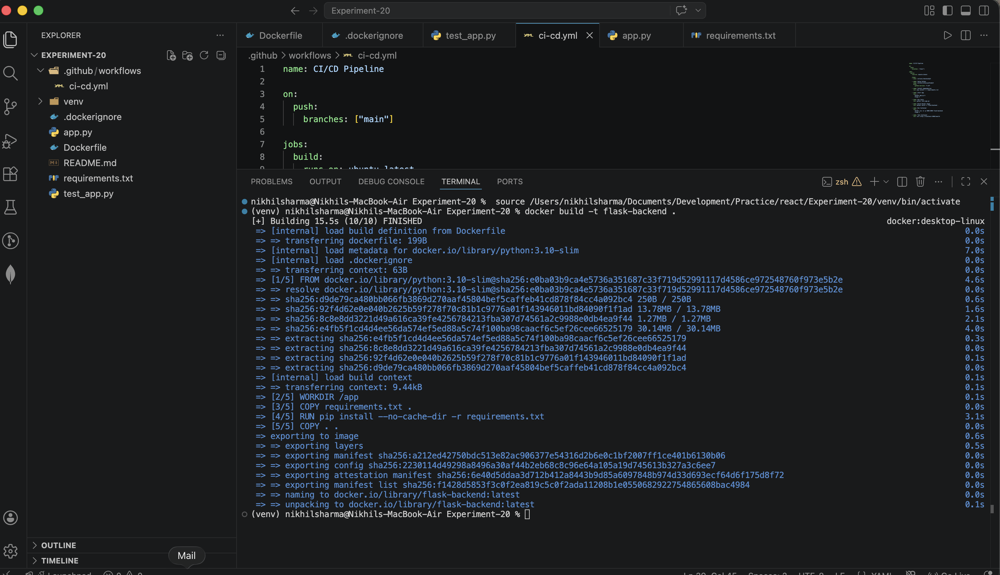
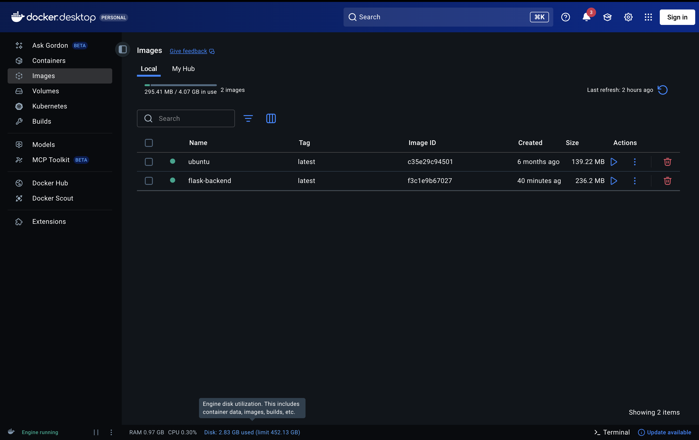
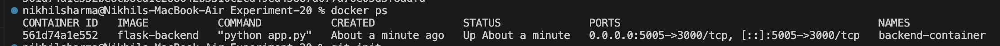
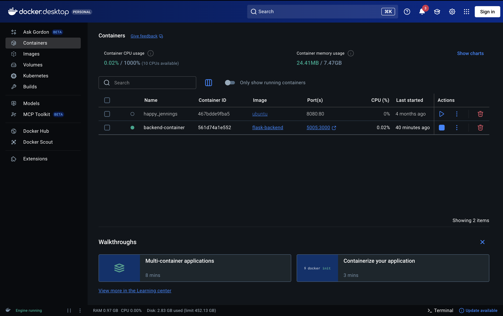
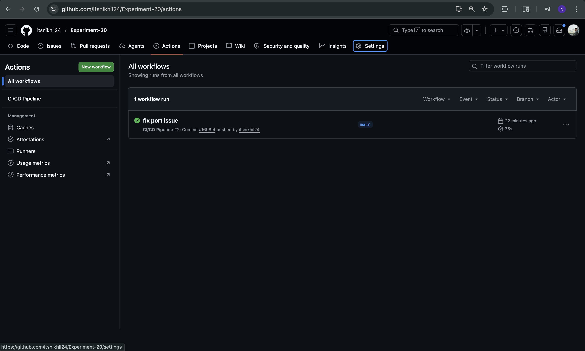
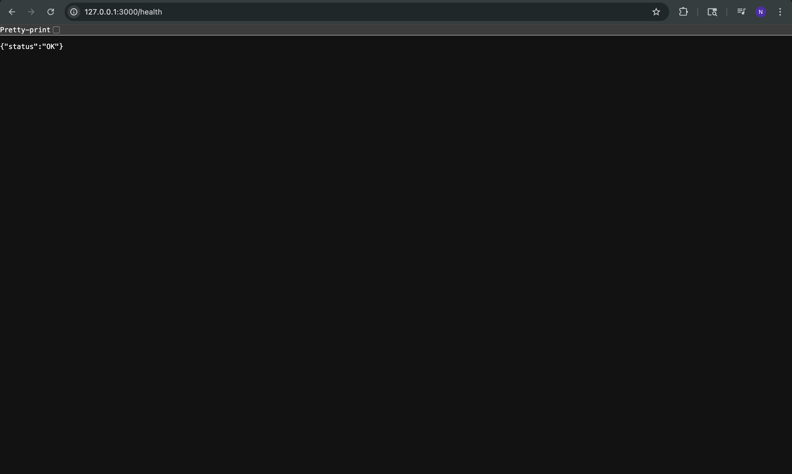

# Experiment 20: CI/CD Pipeline for Backend Deployment

## Screenshots

### Docker Image Creation using CLI


### Docker Image in Docker Desktop


### Docker Container Running (CLI)


### Docker Container in Docker Desktop


### Github Actions


### Heath Check


## Folder Structure

```
EXPERIMENT-20/
│
├── .github/
│   └── workflows/
│       └── ci-cd.yml        # GitHub Actions workflow
│
├── Screenshots/            
│
├── venv/                    # Virtual environment (not pushed to Git)
│
├── app.py                  
├── Dockerfile               
├── requirements.txt        
├── test_app.py              
│
├── .dockerignore           
├── .gitignore              
│
└── README.md              
```

---

## Backend Functionality

The Flask API provides the following endpoints:

| Method | Endpoint       | Description           |
| ------ | -------------- | --------------------- |
| POST   | /students      | Create student        |
| GET    | /students      | Get all students      |
| GET    | /students/{id} | Get single student    |
| PUT    | /students/{id} | Update student        |
| DELETE | /students/{id} | Delete student        |
| GET    | /health        | Health check endpoint |

---

## Local Setup

### 1. Create Virtual Environment

```
python3.10 -m venv venv
source venv/bin/activate
```

### 2. Install Dependencies

```
pip install -r requirements.txt
```

### 3. Run the Application

```
python app.py
```

Open in browser:

* http://localhost:5000/students
* http://localhost:5000/health

---

## Docker Setup

### Build Docker Image

```
docker build -t flask-backend .
```

### Verify Image

```
docker images
```

### Run Container

```
docker run -d -p 5005:5000 --name backend-container flask-backend
```

### Check Running Container

```
docker ps
```

### Stop and Remove Container

```
docker stop backend-container
docker rm backend-container
```

---

## CI/CD Pipeline (GitHub Actions)

The workflow is defined in:

```
.github/workflows/ci-cd.yml
```

### Pipeline Trigger

* Push to `main` branch

### Pipeline Steps

1. Checkout repository
2. Setup Python environment
3. Install dependencies
4. Start Flask server
5. Run automated tests
6. Build Docker image
7. Run Docker container
8. Verify `/health` endpoint

---

## Testing

Automated tests are written in `test_app.py` using `requests`.

They verify:

* API is running
* Student creation works
* Data retrieval works

---

## Screenshots to Submit

You need to include the following:

1. Docker image list

   ```
   docker images
   ```

2. Running container

   ```
   docker ps
   ```

3. Container execution

4. GitHub Actions success workflow

---

## Commands Used for Submission

```
docker build -t flask-backend .
docker images
docker run -d -p 5001:5000 --name backend-container flask-backend
docker ps
docker stop backend-container
docker rm backend-container
```

---

## Key Learnings

* How to build REST APIs using Flask
* Containerization using Docker
* Automating workflows using GitHub Actions
* Importance of health checks in deployment
* Basics of CI/CD pipelines

---

## Conclusion

This experiment demonstrates a complete workflow from development to deployment.
By integrating Docker and GitHub Actions, the application can be tested and deployed automatically, improving reliability and efficiency.

---
